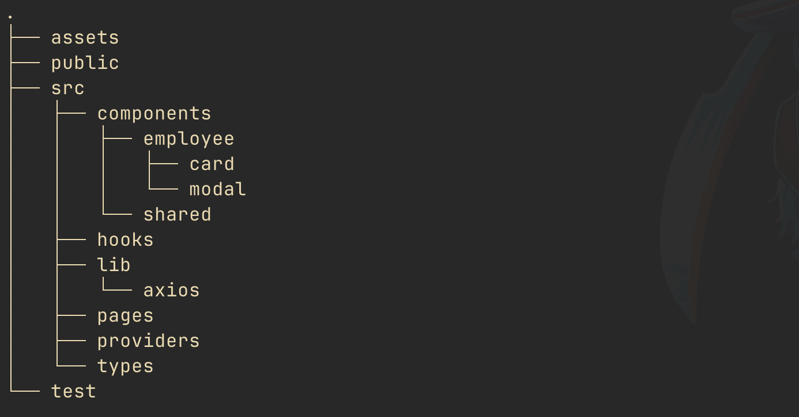

# Client

This is the frontend of the employee maintenance app.

## Technologies used

- Docker
- Make
- React (v18)
- Typescript

## Patterns used

- Clean code
- SOLID principles
- DRY
- Modularization

## File structure



## How to run the client?

*please run it using `docker` to avoid any possible error.*

using `make`
```shell
make up-client
```

using `docker`
```shell
docker-compose -f docker-compose.yml \
                -f ./client/docker-compose.yml \
                up --build -d
```

test the app using `http://localhost:3000/`

## How to turn off the client?

using `make`
```shell
make off-client
```

using `docker`
```shell
docker-compose -f docker-compose.yml \
                -f ./client/docker-compose.yml \
                down
```

## How to test the client?

run tests
```shell
yarn test
```

generate coverage
```shell
yarn test:coverage
```

## Stay in touch

- Author 👷🏾‍♂️- [aLucaz](https://github.com/aLucaz)
- Linkedin 🧛🏾‍♂️- [Arturo Lucas](https://www.linkedin.com/in/arturo-lucas/)

