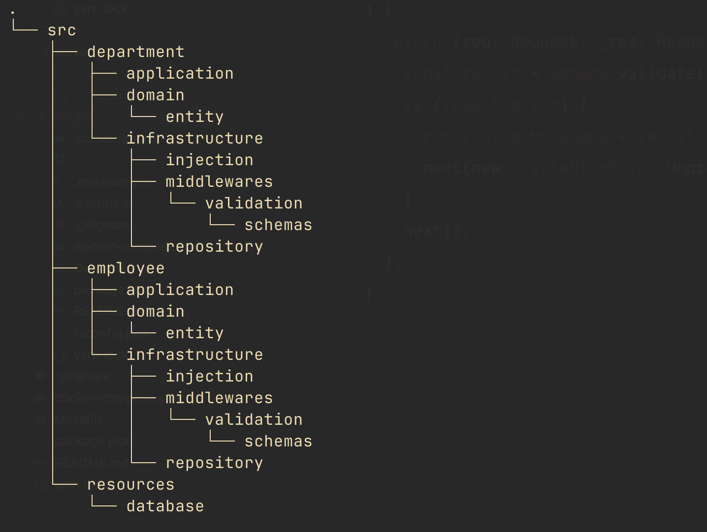

# Server

This is the backend of the employee maintenance app.

## Technologies used

- Node.js (v18)
- Docker
- Make
- Express.js
- Typescript
- Postgres

## Patterns used

- Clean code
- Clean architecture
- Screaming architecture
- SOLID principles
- DTO
- DRY
- Repository pattern

## File structure



## How to run the server?

*please run it using `docker` to avoid any possible error.*

using `make`
```shell
make up-server
```

using `docker`
```shell
docker-compose -f docker-compose.yml \
                -f ./server/docker-compose.yml \
                up --build -d
```

## How to remove the server?

using `make`
```shell
make off-server
```

using `docker`
```shell
docker-compose -f docker-compose.yml \
                -f ./server/docker-compose.yml \
                down
```

## Stay in touch

- Author 👷🏾‍♂️- [aLucaz](https://github.com/aLucaz)
- Linkedin 🧛🏾‍♂️- [Arturo Lucas](https://www.linkedin.com/in/arturo-lucas/)

